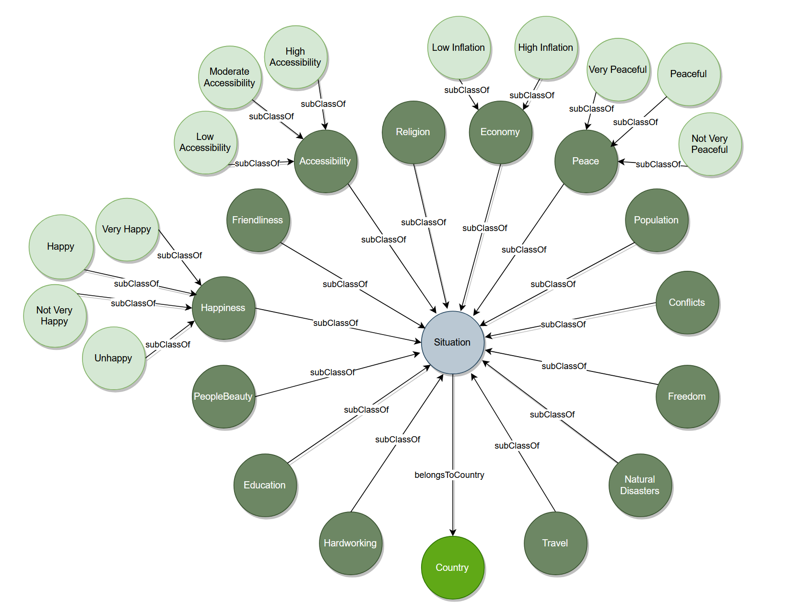
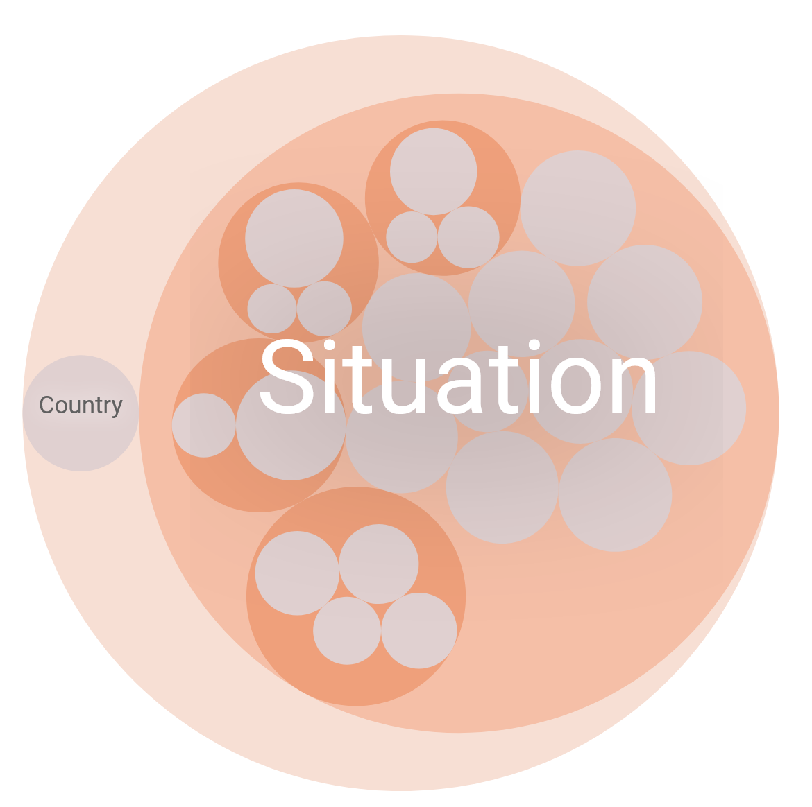

# Global Livability Ontology
Welcome to the Global Living Conditions Data Project! This repository is a comprehensive effort to gather, organize, and integrate information from 29 distinct datasets, each shedding light on different aspects that impact the living conditions across countries worldwide. Using the power of the Semantic Web, our goal is to build a detailed, linked set of data. This data can help us analyze, compare, and understand different factors that play into the quality of life in various places.

## Overview
The Global Living Conditions Data Project covers a lot of ground. We look at things like the economy, education, freedom, happiness, health, natural disasters, and much more. This gives us a full picture of what life is like in different corners of the world. By putting this information into an RDF format and setting up an ontology to define how all these pieces relate to each other, we open the door to deep dives and comparisons that can reveal important insights about life quality. What sets this project apart from others is our extensive use of Semantic Web technologies, which not only enables the integration of a wide variety of data but also allows for more complex queries and insights than traditional datasets. This approach facilitates a more nuanced understanding of global living conditions, providing a unique tool for researchers, policymakers, and the curious public.

Here's what you'll find in this repository:

- **Accessibility**
- **Conflict and Peace**
- **Economic Conditions**
- **Education Levels**
- **Levels of Freedom**
- **Friendliness**
- **Overall Happiness**
- **Work Culture**
- **Natural Disasters**
- **Beauty Perceptions**
- **Population Details**
- **Religious Beliefs**
- **Travel Tips and Warnings**

## Structure
The project is structured as follows:

- **Datasets/**: Contains the raw CSV files used to populate the RDF graph.

- **PopulatedData/**: Contains the Turtle (.ttl) files that represent the serialized RDF graph, one for each aspect of global livability.

## Technical Requirements
To engage with the Global Livability Ontology, a basic understanding of Semantic Web technologies is beneficial. Familiarity with SPARQL for querying RDF data and experience with RDF libraries in programming languages such as Python can greatly enhance your ability to explore and analyze the data. Tools like Protégé for ontology editing for are also useful. Furthermore, incorporating GraphDB as part of the technical stack can provide a robust platform for managing, storing, and querying the ontology data. 

## Getting Started

To explore the Global Livability Ontology, clone this repository and browse through the PopulatedData directory to access the Turtle files. You can use RDF tools and SPARQL endpoints to query and analyze the data.

## Ontology
In the development of our ontology, we carefully created 14 unique classes, along with one additional class specifically designed to hold detailed information about countries, such as their names and languages spoken. To fill these classes with meaningful data, we conducted a thorough search, identifying and combining 29 datasets that match the various attributes of each class in a way that makes logical sense.

To link these classes together, we implemented a single object property, 'belongsToCountry,' which connects all the individual classes to the main Country class. This creates a well-organized and interconnected web of data. Additionally, for certain classes where it was relevant, we created subclasses to further categorize the data. These subclasses allow for the automatic sorting of instances into more specific groups based on the criteria we set. This method enhances the detail and precision of our ontology, enabling more sophisticated analysis and insights.

## Data Cleaning and Preparation
**Convert Countries to ISO 3166-1 Alpha-2 Codes**

As part of our data preparation process, we convert country names of all datasets to their corresponding ISO 3166-1 alpha-2 codes using the pycountry library. This standardization facilitates consistency across datasets and enhances the reliability of our data integration efforts.

**Checking for Consistency**

Our data cleaning process includes checks for consistency and completeness, ensuring that all country values across tables exist in the Country class. This step is crucial for maintaining the integrity of our datasets.

**Handling Multiple Values and Trimming**

We identify countries with multiple entries within the same dataset and resolve these discrepancies to ensure data accuracy. Additionally, we trim strings to remove any leading or trailing spaces, further standardizing our data.

**Merge DataFrames**

We also merge various datasets to enrich the information available for each country. This process involves aligning data based on country attributes and ensuring that our final datasets are comprehensive and cohesive.

## Populating the Data
The process of populating the RDF graph involves meticulously mapping and integrating data from each of our datasets into a coherent semantic structure. This involves creating RDF triples that link entities with their attributes and relationships according to our ontology. The populated data in the RDF graph is then serialized into Turtle format, making it ready for analysis. This structured approach allows us to capture the complexity of global living conditions in a format that is both rich in detail and flexible for querying.

  

  

## Serialization
A key aspect of our project is the serialization of our integrated datasets into Turtle (.ttl) format. Turtle provides a more readable format for RDF data, making it easier for humans to understand and machines to process. This step is crucial for ensuring that our data is accessible and usable, allowing for the complex querying and analysis that sets our project apart.

## Queries
**1. Retrieve the names and languages of European countries characterized by high accessibility, a high happiness index, and low inflation rates.**

    PREFIX glo: <http://www.MT.org/graphDatabase/GlobalLivabilityOntology#>
    select ?name ?language where { 
    	?country glo:shortName ?name;
              glo:continent "Europe";
              glo:language ?language.
        ?happiness glo:belongsToCountry ?country;
                   a glo:VeryHappy.
        ?accessibility glo:belongsToCountry ?country;
                       a glo:HighAccessibility.
        ?economy glo:belongsToCountry ?country;
                a glo:LowInflation.
    }
    order by asc(?name)
***Result:***
| Name            | Language         |
|-----------------|------------------|
| Austria         | German           |
| Croatia         | Croatian         |
| Cyprus          | Greek            |
| Czech Republic  | Czech            |
| Denmark         | Danish           |
| Estonia         | Estonian         |
| Finland         | Swedish          |
| France          | French           |
| Germany         | German           |
| Greece          | Greek            |
| Hungary         | Hungarian        |
| Iceland         | Icelandic        |
| Ireland         | Irish            |
| Italy           | Italian          |
| Latvia          | Latvian          |
| Lithuania       | Lithuanian       |
| Malta           | Maltese          |
| Netherlands     | Dutch            |
| Norway          | Norwegian        |
| Portugal        | Portuguese       |
| Romania         | Romanian         |
| Serbia          | Serbian          |
| Slovak Republic | Slovak           |
| Slovenia        | Slovene language |
| Spain           | Spanish          |
| Sweden          | Swedish          |
| Switzerland     | German           |
| United Kingdom  | English          |

**2. Calculate the average inflation rate of European countries.**

    PREFIX glo: <http://www.MT.org/graphDatabase/GlobalLivabilityOntology#>
    select (AVG(?inflation) as ?EuropeInflation) where { 
    	?country glo:continent "Europe".
        ?economy glo:belongsToCountry ?country;
                a glo:Economy;
                glo:inflation ?inflation.
    }
***Result:***
| EuropeInflation |
|----------|
| 10.851866|

**3. Retrieve the full names and currencies of peaceful Asian countries with high accessibility.**

    PREFIX glo: <http://www.MT.org/graphDatabase/GlobalLivabilityOntology#>
    select ?name ?currency where { 
    	?country glo:fullName ?name;
              glo:currency ?currency;
              glo:continent "Asia".
        ?peace glo:belongsToCountry ?country;
                       a glo:Peaceful.
        ?accessibility glo:belongsToCountry ?country;
                      a glo:HighAccessibility.
    }
    order by asc(?name)
***Result:***
| Name                                | Currency           |
|-------------------------------------|--------------------|
| Hashemite Kingdom of Jordan         | Jordanian dinar    |
| Japan                               | Japanese yen       |
| Kingdom of Cambodia                 | Cambodian riel     |
| Lao People's Democratic Republic    | Lao kip            |
| Malaysia                            | Malaysian ringgit  |
| Mongolia                            | Mongolian tugrik   |
| Republic of Armenia                 | Armenian dram      |
| Republic of Indonesia               | Indonesian rupiah  |
| Republic of Kazakhstan              | Kazakh tenge       |
| Republic of Korea                   | Korean won         |
| Republic of Singapore               | Singapore dollar   |
| Socialist Republic of Vietnam       | Vietnamese dong    |
| State of Kuwait                     | Kuwaiti dinar      |
| State of Qatar                      | Qatari riyal       |
| Sultanate of Oman                   | Omani rial         |
| United Arab Emirates                | U.A.E. dirham      |

**4. Retrieve name of the countries in the Americas with the lowest incidence of natural disasters.**

    PREFIX glo: <http://www.MT.org/graphDatabase/GlobalLivabilityOntology#>
    select ?name (COUNT(?year) as ?NumberOfDisasters) where { 
    	?country glo:shortName ?name;
              glo:continent "Americas".
        ?naturalDisaster glo:belongsToCountry ?country;
                         glo:year ?year;
                       a glo:NaturalDisaster;                  
    }
    Group by ?name
    order by asc(?NumberOfDisasters)
    limit 10

***Result:***
| Name                    | NumberOfDisasters |
|-------------------------|-------------------|
| Anguilla                | 1                 |
| Saint Barthélemy        | 1                 |
| Bermuda                 | 1                 |
| St. Kitts and Nevis     | 1                 |
| Saint Martin            | 1                 |
| Montserrat              | 1                 |
| Sint Maarten            | 1                 |
| Virgin Islands (British)| 1                 |
| Grenada                 | 2                 |
| French Guiana           | 2                 |

**5. Retrieve name of European countries with the least racism and high proficiency in English.**

    PREFIX glo: <http://www.MT.org/graphDatabase/GlobalLivabilityOntology#>
    select ?name where { 
    	?country glo:shortName ?name;
              glo:continent "Europe".
        ?happiness glo:belongsToCountry ?country;
                   a glo:Education;
                   glo:englishProficiency "High".
        ?friendliness glo:belongsToCountry ?country;
                   a glo:Friendliness;
                   glo:leastRacist ?leastRacist.
    }
    order by asc(?leastRacist)
    limit 4

***Result:***
| Name                    |
|-------------------------|
| Switzerland             | 
| Luxembourg              | 
| Greece                  |
| Bulgaria                |

**6. Retrieve name of the countries outside of the Americas and Europe that do not have McDonald's and have poor internet speed.**

    PREFIX glo: <http://www.MT.org/graphDatabase/GlobalLivabilityOntology#>
    PREFIX xsd: <http://www.w3.org/2001/XMLSchema#>
    select ?name where { 
    	?country glo:shortName ?name.
        ?accessibility glo:belongsToCountry ?country;
                       a glo:Accessibility;
                       glo:withoutMcDonalds ?withoutMcDonalds;
                       glo:internetSpeed ?internetSpeed.
            FILTER NOT EXISTS{?country glo:continent "Americas","Europe"}
            FILTER (?internetSpeed<"20"^^xsd:integer)
    }
    order by asc(?internetSpeed)

***Result:***
| Name                 |
|----------------------|
| Afghanistan          |
| Syrian Arab Republic |
| Niger                |
| Burundi              |
| Yemen                |
| The Gambia           |
| Ethiopia             |
| Botswana             |
| Sudan                |
| Turkmenistan         |
| Libya                |
| Guinea               |
| Kenya                |
| Zimbabwe             |
| Cameroon             |
| Vanuatu              |
| Papua New Guinea     |
| Algeria              |
| Bhutan               |
| Somalia              |
| Uganda               |
| Mozambique           |
| Iran                 |
| Micronesia           |
| Maldives             |
| Angola               |
| Cabo Verde           |
| Mauritania           |
| Sierra Leone         |
| Tanzania             |
| Malawi               |
| Nigeria              |
| Djibouti             |

**7. Is the average internet speed in European countries higher than in countries in the Americas?**

    PREFIX glo: <http://www.MT.org/graphDatabase/GlobalLivabilityOntology#>
    ASK where{
    
    {
        select (AVG(?internetSpeed) as ?EuropeInternetSpeed) where { 
    	?country glo:shortName ?name;
              glo:continent "Europe".
        ?accessibility glo:belongsToCountry ?country;
                       a glo:Accessibility;
                       glo:internetSpeed ?internetSpeed.}
     }
        {select (AVG(?internetSpeed) as ?AmericasInternetSpeed) where { 
    	?country glo:shortName ?name;
              glo:continent "Americas".
        ?accessibility glo:belongsToCountry ?country;
                       a glo:Accessibility;
                       glo:internetSpeed ?internetSpeed.}
     }
        FILTER (?EuropeInternetSpeed > ?AmericasInternetSpeed)
    }
***Result:***

**8. Retrieve the continents of countries that are considered dangerous for travel.**

    PREFIX glo: <http://www.MT.org/graphDatabase/GlobalLivabilityOntology#>
    select ?continent (COUNT(?name) AS ?NumberofCountries) where { 
    	?country glo:shortName ?name;
              glo:continent ?continent.
        ?travel glo:belongsToCountry ?country;
                   a glo:Travel;
                   glo:worstToVisitTravel ?worstToVisit.
    }
    group by (?continent)
    order by desc(?NumberofCountries)

***Result:***
| Continent | Number of Countries |
|-----------|---------------------|
| Asia      | 8                   |
| Africa    | 7                   |
| Europe    | 3                   |
| Americas  | 3                   |

**9. Retrieve name of the countries known for having both the most beautiful women and the most handsome men.**

    PREFIX glo: <http://www.MT.org/graphDatabase/GlobalLivabilityOntology#>
    select ?name where { 
    	?country glo:shortName ?name.
        ?peopleBeauty glo:belongsToCountry ?country;
                   a glo:PeopleBeauty;
                   glo:mostBeautifulWomen ?mostBeautifulWomen;
                   glo:mostHandsomeMen ?mostHandsomeMen.              
    }
    order by asc(?mostBeautifulWomen)

***Result:***
| Name        |
|-------------|
| Italy       |
| India       |
| Philippines |
| Turkey      |
| Korea       |
| Spain       |
| Venezuela   |
| France      |
| Russia      |
| Indonesia   |

**10. Retrieve the continents with the highest number of conflicts.**

    PREFIX glo: <http://www.MT.org/graphDatabase/GlobalLivabilityOntology#>
    select ?continent (SUM(?Conflits) as ?TotalConflits) where{
    	?country glo:shortName ?name;
              glo:continent ?continent.
        {select ?name (Count(?date) AS ?Conflits) where { 
    	?country glo:shortName ?name.
        ?conflict glo:belongsToCountry ?country;
                   a glo:Conflict;
                   glo:date ?date.   
    }
    group by(?name)
    order by desc(?Conflits)
    }
    FILTER (?Conflits>5)
    }
    group by(?continent)

***Result:***
| Continent | Total Conflicts |
|-----------|-----------------|
| Asia      | 141             |
| Africa    | 105             |
| Americas  | 32              |
| Europe    | 7               |

## Datasets Used
Below are links to the datasets utilized in this project:

https://www.kaggle.com/datasets/adityakishor1/all-countries-details

https://www.kaggle.com/datasets/nelgiriyewithana/countries-of-the-world-2023

https://worldpopulationreview.com/country-rankings/best-healthcare-in-the-world

https://worldpopulationreview.com/country-rankings/countries-without-mcdonalds

https://worldpopulationreview.com/country-rankings/internet-speeds-by-country

https://worldpopulationreview.com/country-rankings/countries-with-most-beautiful-women

https://worldpopulationreview.com/country-rankings/countries-with-the-most-handsome-men

https://www.kaggle.com/datasets/ramjasmaurya/conflicts-among-nations

https://worldpopulationreview.com/country-rankings/most-peaceful-countries

https://www.kaggle.com/datasets/abhijitdahatonde/worldwide-average-iq-levels

https://worldpopulationreview.com/country-rankings/countries-that-censor-the-internet

https://worldpopulationreview.com/country-rankings/countries-where-alcohol-is-illegal

https://worldpopulationreview.com/country-rankings/countries-where-abortion-is-illegal

https://worldpopulationreview.com/country-rankings/gender-equality-by-country

https://worldpopulationreview.com/country-rankings/countries-where-burqa-is-mandatory

https://worldpopulationreview.com/country-rankings/countries-with-mandatory-military-service

https://worldpopulationreview.com/country-rankings/lgbt-rights-by-country

https://worldpopulationreview.com/country-rankings/friendliest-countries

https://worldpopulationreview.com/country-rankings/least-racist-countries

https://worldpopulationreview.com/country-rankings/most-homophobic-countries

https://www.kaggle.com/datasets/jahaidulislam/world-happiness-report-2005-2021

https://worldpopulationreview.com/country-rankings/countries-with-the-most-holidays

https://worldpopulationreview.com/country-rankings/most-overworked-countries

https://worldpopulationreview.com/country-rankings/hardest-working-countries

https://www.emdat.be/

https://www.kaggle.com/datasets/abdurrakibmollah/religious-populations-across-the-world

https://worldpopulationreview.com/country-rankings/least-religious-countries

https://worldpopulationreview.com/country-rankings/most-visited-countries

https://worldpopulationreview.com/country-rankings/worst-countries-to-visit

